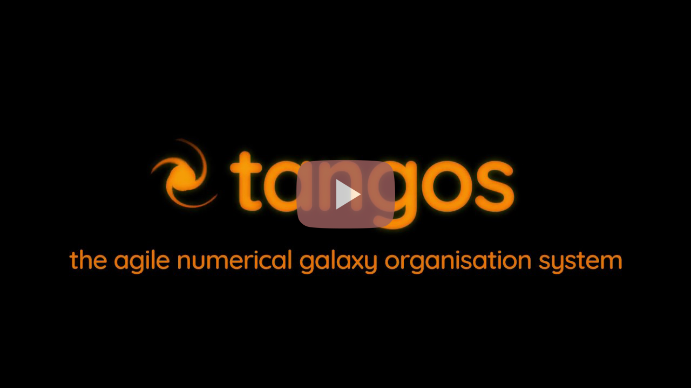

Data exploration with tango's web interface
-------------------------------------------


Before completing this tutorial, you need to have set up _tangos_ and added the
tutorial data to your first database. To skip adding the data, you can download the
[sample database](https://zenodo.org/record/5168449/files/tangos_data.db?download=1) here. Make sure the environment variable `TANGOS_DB_CONNECTION`
contains the full path to this database (or just put it in your home folder as
`tangos_data.db`).

Once that's done, type `tangos serve`. (For experts: this is just a shortcut to launching pyramid's
`pserve`). You should see some messages finishing with:

```
Serving on http://localhost:6543
```

Navigate your browser to that address to start playing. Click the video below to start a
tour of the data exploration features.

[](https://www.youtube.com/watch?v=xHyzJmNsVMw)
