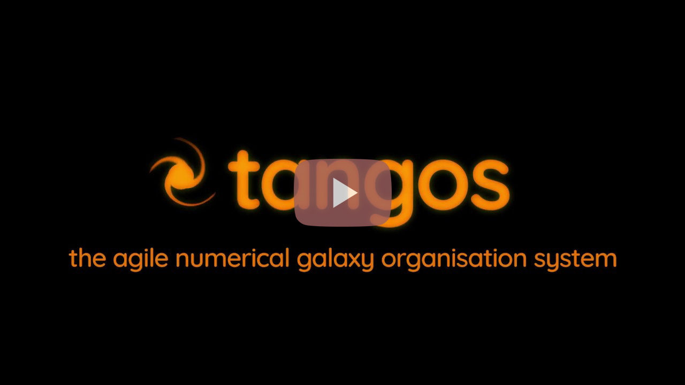

.. Checked by AP 5/09/26

.. _webserver:

Exploring a database in the browser
===================================

Everything in the preceding tutorials queries the database from python. tangos
also ships a web interface over the same database, which is often the faster
way to find your way around an unfamiliar set of simulations: it lists the simulations and
timesteps, plots any property against any other, draws merger trees, and turns
a live calculation into a column of a table without your writing any code.

.. note:: Before you start, make sure tangos is installed and
 can find the tutorial database;
 :ref:`installation` covers both. The examples here query an existing
 database, so you need no simulation files.

Starting the server
-------------------

At the command line:

.. code-block:: bash

  $ tangos serve

It prints the address it is listening on -- ``Serving on
http://127.0.0.1:6543`` -- and you open that in a browser. The server reads
the same ``TANGOS_DB_CONNECTION`` as everything else, so it shows the database
you have been querying from python.

You can choose the port yourself, and give the server a title, which is worth
doing as soon if you have more than one open at once:

.. code-block:: bash

  $ tangos serve --title "black holes run" production.ini 6544

Stop the server with :kbd:`Control-c`.

.. note:: ``tangos serve`` is a shortcut to Pyramid's ``pserve``. The optional
   first positional argument names the configuration file -- ``production.ini``
   (the default), ``development.ini``, or a path to one of your own -- and the
   port is the *second*. That ordering is why the port has to be given after a
   configuration file, as above, rather than on its own.

What the interface gives you
----------------------------

A tour of the web interface, from an earlier version of tangos:

A timestep's table of objects takes *live calculation expressions* as columns.
Anything you could pass to
:meth:`~tangos.core.timestep.TimeStep.calculate_all` in
:doc:`/tutorials/live_calculations` -- ``earlier(2).mass``, ``at(Rvir/4,
dm_density_profile)``, a redirection through a link -- can be typed into a
column heading and evaluated for every object in the timestep. The browser then
becomes a way of exploring the calculation language interactively, which can
help work out what you want before writing it into a script.

The interface also draws merger trees, and serves the underlying numbers over
URLs you can fetch from a script rather than a browser.

.. seealso::

   Fuller documentation of the web interface -- the merger-tree viewer and the
   URL API for fetching data programmatically -- is still to be written.
   :doc:`/tutorials/quickstart` and
   :doc:`/tutorials/live_calculations` cover the same ground from python, and
   :ref:`configuration` lists the ``webview_`` settings that control image
   format, resolution and caching.
